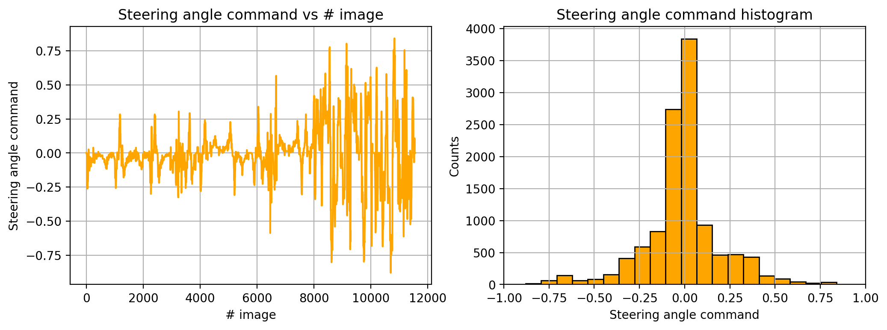

# Cloning Driving Behavioral using Deep Learning
## Overview
This project uses deep neural networks and convolutional neural networks to train a vehicle drive in the middle of the road. Specifically, a vehicle simulator is used to collect images of manual driving and a deep learning model then predicts steering angle in autonomous driving mode.


### The Goals of this Project :
* Use vehicle simulator to collect training images
* Load, preprocess and explore the training data set
* Design a deep neural network architecture using Keras API
* Train the deep neural network model and validate it
* Test the model to ensure it predicts accurate steering commands and drives in the middle of the road


### Submitted Files
The project includes the following files:
* `README.md` - A markdown file explaining the project structure and training approach
* `model.py` - The script used to create and train the model
* `drive.py` - The script to drive the car
* `model.h5` - The saved deep learning model
* `video.mp4` - A video recording of the vehicle driving autonomously one lap around the track

### Running the Model
You can test your model by launching the simulator and entering autonomous mode. The car will just sit there until your Python server connects to it and provides it steering angles. Here’s how you start your Python server:

```python 
python drive.py model.h5
```
Once the model is up and running in drive.py, you should see the car move around


Below I will consider the [rubric points](https://review.udacity.com/#!/rubrics/1968/view) of this project individually and describe how I addressed each point in my implementation. Here is the link to my [project exploratory code](Behavioral_Cloning.ipynb).

## Training Data Collection

The goal of this project is to drive down the center of the the road. To achieve this, it's necessary to capture a good driving behavior which means driving the vehicle in the center of the road while capturing the training images. 

**My strategy for collecting the training data**:
* Drive 2 laps counter-clockwise on the 1st track while staying in the center of the road as much as possible
* Drive 1 lap and record recovery from side of the road - this helps the model learn coming back to the center of the road  
* Drive 1 lap counter-clockwise while staying in the center of the road as much as possible - the model learns to generalize
* Record driving through sharp curves (each curve 2x times) - sharp curves are difficult task for the model to learn, so increasing the amount of data for the model to learn from
* Drive 1 lap on the 2nd track to help generalize the model

The vehicle simulator collects images from 3 cameras which can be used for the model training to improve the accuracy especially for recovery driving from road sides. More details in next section. 

Total number of collected images (per camera): **11555**

Here is a visualization of steering angle command versus image #:


Note that the first part image 0 to image 7000 represents driving on the 1st track, while the last part represents driving on the 2nd track. One can notice that the steering angle command values are much larger for the 2nd track as the track consists of sharp left and right turns. Such data can very well generalize the model as we will see later on. 

In order to explain why I decided to follow my strategy for collecting the training data, let's first look on the steering angle command distribution for data collected on the first track driving it counter-clockwise for approximately 2 laps:


It's clear from the histogram that the distribution is left skewed representing a bias in steering angle command as we drove the vehicle in counter-clock wise direction.


All data collected on the first track (including recovery and smooth driving through curves)


Second track (jungle) driving


All images combined creates dataset with the folowing symmetric distribution. A nice symmetric distribution



## Loading Data, Preprocessing and Data Augmentation


flipping the images is a quick way to augment the data


## Model Architecture and Training Strategy
This section describes the deep neural network model deployed and the training strategy used.

### Model Architecture
I first tried to use LeNet neural network to see how well the model would predict steering angle command. I mainly used it to get started with the project and develop the training pipeline since I was already familiar with the model. Nevertheless, the model seemed not to predict the steering command accurately in all cases. Especially in sharp curves without lane markings the model went off the road. 

So, I decided to use a more powerfull network. One of the more advanced model architectures is a convolutional neural network published by vehicle team at NVIDIA that maps raw pixels from a camera directly to steering commands. 
Here is a [link](http://images.nvidia.com/content/tegra/automotive/images/2016/solutions/pdf/end-to-end-dl-using-px.pdf) that describes the model in detail.

The network consists of 9 layers, including a normalization layer, 5 convolutional layers and 3 fully connected layers. It has about 27 million connections and 250 thousand parameters as shown in the figure below:


I took this architecture as a baseline and performed few modifications. The input to the network is different from the original model, since the training images come in shape of 160x320px with 3 color channels (RGB) that are passed to the network. The first layer performs image preprocessing: Normalization and mean centering. This was implemented using `Lambda` layer:

```python
Lambda(lambda x: x / 255.0 - 0.5, input_shape=(160,320,3))
```

The next layer is used to crops the images on top 70px and on bottom 25px. This step is done to make sure that the images capture mainly the road and nothing else that would complicate the training from these images. It also reduces training time as the image size gets smaller. This was implemented using `Cropping2D` layer:

```python
Cropping2D(cropping=((70,25), (0,0)))
```

Next, series of 5 convolutional layers with striding an relu activation function was added. The first three convolutional layers use a 2×2 stride and a 5×5 kernel and the last two convolutional layers use a 1x1 stride convolution with a 3×3 kernel size.

```python
Conv2D(24, (5, 5), strides=(2, 2), activation="relu")
Conv2D(36, (5, 5), strides=(2, 2), activation="relu")
Conv2D(48, (5, 5), strides=(2, 2), activation="relu")
Conv2D(64, (3, 3), strides=(1, 1), activation="relu")
Conv2D(64, (3, 3), strides=(1, 1), activation="relu")
```

The output from the last convolutional layer is first flattened into shape of 2112 inputs and then feeded into a series of 3 fully connected layers. The first fully connected layer consists of 100 output units. To avoid overfitting a dropout layer is added with 35% dropout probability. A next fully connected layer with 50 output units is again used and followed by a dropout layer. The third fully connected layer has 10 outputs and no dropout layer is used anymore.

```python
Flatten()
Dense(100)
Dropout(rate=0.35)
Dense(50)
Dropout(rate=0.35)
Dense(10)
```

Since the output from the neural network model is predicting one value (steering angle command), a fully connected layer with one output unit is used here.

```python
Dense(1)
```

**Final model architecture**

The following table shows the final model architecture:

|Layer|Description|Param #|
|---|---|---|
|Input | 160x320x3 image|0|
|Lambda| Normalization & mean centering, output 160x320x3| 0|
|Cropping2D | Crop input images, output 65x320x3 | 0|
|Convolution 5x5| 2x2 stride, activation:relu, output 31x158x24| 1824|
|Convolution 5x5| 2x2 stride, activation:relu, output 14x77x36| 21636|
|Convolution 5x5| 2x2 stride, activation:relu, output 5x37x48| 43248|
|Convolution 3x3| 1x1 stride, activation:relu, output 3x35x64| 27712|
|Convolution 3x3| 1x1 stride, activation:relu, output 1x33x64| 36928|
|Flatten| output 2112| 0|
|Fully connected| output 100| 211300|
|Dropout|drop probability 35%| 0|
|Fully connected| output 50| 5050|
|Dropout|drop probability 35%| 0| 
|Fully connected| output 10| 510|
|Fully connected| output 1| 11|

* Total params: 348,219
* Trainable params: 348,219
* Non-trainable params: 0

This model achitecture is defined in `nvidia_nn()` function. 

As a next step I configured the model for training. Specificaly, the command below (part of `nvidia_nn()` function)

```python
model.compile(optimizer='adam', loss='mse')
```
sets the type of optimizer to be used and the objective function to minimized. I selected `'adam'` algorithm which is an extension to stochastic gradient descent that updates network weights iteratively for each NN parameter instead of maintaining a single learning rate for all updates during training. This makes `'adam'` a great choice as it requires little tuning effort. 

It's well worth to have a look on the training performance for different optimization algoritms to see how well Adam outperforms some of the other types of optimizators. Here is provided [here](https://machinelearningmastery.com/adam-optimization-algorithm-for-deep-learning/). 

The steering angle command prediction we are trying to solve in this project represents a classical regression problem. Regression problem optimization can be mathematically achieved by minimizing an objective function. A suitable objective function is for example **mean squared error** function. Therefore, the next paramter to be set in `model.compile()` is `loss='mse'`  

### Model Training
Having the model architecture defined, the training step can be conducted. As mentioned in previous [section](????????  ????????) a Python generator will be used to load and preprocess image training data in batches which is much more memory-efficient than loading all image data in memory at once.

First two generators (one for training and one for validation) are saved as

```python
train_generator      = generator(train_samples, fliped=True, all_cameras=True, 
                                 correction=0.1, batch_size=batch_size)
validation_generator = generator(validation_samples, fliped=True, all_cameras=True, 
                                 correction=0.1, batch_size=batch_size)
```

Next, the neural network model with dropout set to 35% is saved as
```python
model = nvidia_nn(dropout=0.35)
```

One of the challenges when training neural networks is to set appropriate number of epochs before the training is terminated.
Keras offers a great solution to this problem by using Callbacks which is a set of functions to be applied at given stages of the training procedure. 

Two callback functions can be used to ensure the model stops at appropriate time, doesn't overfit and the best model from the training phase is saved: `EarlyStopping` and `ModelCheckpoint`:

`EarlyStopping` called as: 

```python
early_stop = EarlyStopping(monitor='val_loss', verbose=1, patience=3)
```
stops the training when a monitored quantity has stopped improving. Here the quantity to be monitored is the validation loss.
The `patience` parameter specifies number of epochs that produced the monitored quantity with no improvement after which training will be stopped.

`ModelCheckpoint` called as:

```python
model_ckp = ModelCheckpoint('./models/best_model.h5', monitor='val_loss', 
                            verbose=1, save_best_only=True)
```
saves the model after every epoch. But since `save_best_only=True` only the the latest best model with respect to validation loss will be saved.


Last step is to train the model for a fixed number of epochs by calling `model.fit_generator()`:


```python
history_object = model.fit_generator(train_generator, 
                                     steps_per_epoch=np.ceil(len(train_samples)/batch_size), 
                                     validation_data=validation_generator, 
                                     validation_steps=np.ceil(len(validation_samples)/batch_size), 
                                     epochs=30,
                                     callbacks=[early_stop, model_ckp],
                                     verbose=1)
```

This will train the model on data generated batch-by-batch by the Python generator for 30 epochs unless early stopping is activated.

To monitor training and validation loss metrics a model history object which is returned from `model.fit_generator()` is saved under `history_object` variable that contains both loss functions for each epoch. 

Here is the visualization of training/validation loss vs epoch #:


The `best_model.h5` contains model from epoch=17 ??????????. In the file called `model.h5` the last epoch is saved and it is not necessarily the best model from the training.


BELOW is the training output shown:

Epoch 1/30
144/145 [============================>.] - ETA: 0s - loss: 0.0225Epoch 00001: val_loss improved from inf to 0.01325, saving model to ./models/best_model.h5
145/145 [==============================] - 94s 650ms/step - loss: 0.0225 - val_loss: 0.0133
Epoch 2/30
144/145 [============================>.] - ETA: 0s - loss: 0.0129Epoch 00002: val_loss improved from 0.01325 to 0.01055, saving model to ./models/best_model.h5
145/145 [==============================] - 92s 637ms/step - loss: 0.0129 - val_loss: 0.0106
Epoch 3/30
144/145 [============================>.] - ETA: 0s - loss: 0.0105Epoch 00003: val_loss improved from 0.01055 to 0.00950, saving model to ./models/best_model.h5
145/145 [==============================] - 92s 631ms/step - loss: 0.0105 - val_loss: 0.0095
Epoch 4/30
144/145 [============================>.] - ETA: 0s - loss: 0.0088Epoch 00004: val_loss improved from 0.00950 to 0.00718, saving model to ./models/best_model.h5
145/145 [==============================] - 92s 634ms/step - loss: 0.0088 - val_loss: 0.0072
Epoch 5/30
144/145 [============================>.] - ETA: 0s - loss: 0.0083Epoch 00005: val_loss improved from 0.00718 to 0.00661, saving model to ./models/best_model.h5
145/145 [==============================] - 91s 627ms/step - loss: 0.0082 - val_loss: 0.0066
Epoch 6/30
144/145 [============================>.] - ETA: 0s - loss: 0.0077Epoch 00006: val_loss did not improve
145/145 [==============================] - 91s 631ms/step - loss: 0.0077 - val_loss: 0.0073
Epoch 7/30
144/145 [============================>.] - ETA: 0s - loss: 0.0071Epoch 00007: val_loss did not improve
145/145 [==============================] - 90s 622ms/step - loss: 0.0071 - val_loss: 0.0069
Epoch 8/30
144/145 [============================>.] - ETA: 0s - loss: 0.0068Epoch 00008: val_loss improved from 0.00661 to 0.00570, saving model to ./models/best_model.h5
145/145 [==============================] - 91s 629ms/step - loss: 0.0067 - val_loss: 0.0057
Epoch 9/30
144/145 [============================>.] - ETA: 0s - loss: 0.0061Epoch 00009: val_loss did not improve
145/145 [==============================] - 91s 630ms/step - loss: 0.0061 - val_loss: 0.0061
Epoch 10/30
144/145 [============================>.] - ETA: 0s - loss: 0.0059Epoch 00010: val_loss improved from 0.00570 to 0.00549, saving model to ./models/best_model.h5
145/145 [==============================] - 91s 630ms/step - loss: 0.0059 - val_loss: 0.0055
Epoch 11/30
144/145 [============================>.] - ETA: 0s - loss: 0.0055Epoch 00011: val_loss improved from 0.00549 to 0.00525, saving model to ./models/best_model.h5
145/145 [==============================] - 88s 609ms/step - loss: 0.0055 - val_loss: 0.0053
Epoch 12/30
144/145 [============================>.] - ETA: 0s - loss: 0.0050Epoch 00012: val_loss improved from 0.00525 to 0.00504, saving model to ./models/best_model.h5
145/145 [==============================] - 88s 606ms/step - loss: 0.0050 - val_loss: 0.0050
Epoch 13/30
144/145 [============================>.] - ETA: 0s - loss: 0.0050Epoch 00013: val_loss improved from 0.00504 to 0.00480, saving model to ./models/best_model.h5
145/145 [==============================] - 88s 607ms/step - loss: 0.0050 - val_loss: 0.0048
Epoch 14/30
144/145 [============================>.] - ETA: 0s - loss: 0.0046Epoch 00014: val_loss did not improve
145/145 [==============================] - 88s 608ms/step - loss: 0.0046 - val_loss: 0.0050
Epoch 15/30
144/145 [============================>.] - ETA: 0s - loss: 0.0045Epoch 00015: val_loss did not improve
145/145 [==============================] - 88s 608ms/step - loss: 0.0045 - val_loss: 0.0049
Epoch 16/30
144/145 [============================>.] - ETA: 0s - loss: 0.0042Epoch 00016: val_loss improved from 0.00480 to 0.00470, saving model to ./models/best_model.h5
145/145 [==============================] - 88s 607ms/step - loss: 0.0042 - val_loss: 0.0047
Epoch 17/30
144/145 [============================>.] - ETA: 0s - loss: 0.0042Epoch 00017: val_loss did not improve
145/145 [==============================] - 88s 607ms/step - loss: 0.0042 - val_loss: 0.0053
Epoch 18/30
144/145 [============================>.] - ETA: 0s - loss: 0.0040Epoch 00018: val_loss improved from 0.00470 to 0.00434, saving model to ./models/best_model.h5
145/145 [==============================] - 88s 609ms/step - loss: 0.0040 - val_loss: 0.0043
Epoch 19/30
144/145 [============================>.] - ETA: 0s - loss: 0.0038Epoch 00019: val_loss did not improve
145/145 [==============================] - 87s 602ms/step - loss: 0.0038 - val_loss: 0.0046
Epoch 20/30
144/145 [============================>.] - ETA: 0s - loss: 0.0037Epoch 00020: val_loss did not improve
145/145 [==============================] - 87s 601ms/step - loss: 0.0037 - val_loss: 0.0044
Epoch 21/30
144/145 [============================>.] - ETA: 0s - loss: 0.0037Epoch 00021: val_loss improved from 0.00434 to 0.00413, saving model to ./models/best_model.h5
145/145 [==============================] - 89s 612ms/step - loss: 0.0037 - val_loss: 0.0041
Epoch 22/30
144/145 [============================>.] - ETA: 0s - loss: 0.0033Epoch 00022: val_loss did not improve
145/145 [==============================] - 88s 605ms/step - loss: 0.0033 - val_loss: 0.0042
Epoch 23/30
144/145 [============================>.] - ETA: 0s - loss: 0.0032Epoch 00023: val_loss did not improve
145/145 [==============================] - 88s 603ms/step - loss: 0.0032 - val_loss: 0.0046
Epoch 24/30
144/145 [============================>.] - ETA: 0s - loss: 0.0033Epoch 00024: val_loss improved from 0.00413 to 0.00412, saving model to ./models/best_model.h5
145/145 [==============================] - 93s 640ms/step - loss: 0.0033 - val_loss: 0.0041
Epoch 25/30
144/145 [============================>.] - ETA: 0s - loss: 0.0031Epoch 00025: val_loss did not improve
145/145 [==============================] - 89s 615ms/step - loss: 0.0031 - val_loss: 0.0042
Epoch 26/30
144/145 [============================>.] - ETA: 0s - loss: 0.0031Epoch 00026: val_loss did not improve
145/145 [==============================] - 86s 595ms/step - loss: 0.0031 - val_loss: 0.0044
Epoch 27/30
144/145 [============================>.] - ETA: 0s - loss: 0.0032Epoch 00027: val_loss did not improve
145/145 [==============================] - 89s 617ms/step - loss: 0.0032 - val_loss: 0.0042
Epoch 00027: early stopping


## Simulation and Model Testing


Testing Your Network
Once you're satisfied that the model is making good predictions on the training and validation sets, you can test your model by launching the simulator and entering autonomous mode.

The car will just sit there until your Python server connects to it and provides it steering angles. Here’s how you start your Python server:

python drive.py model.h5

Once the model is up and running in drive.py, you should see the car move around (and hopefully not off) the track! If your model has low mean squared error on the training and validation sets but is driving off the track, this could be because of the data collection process. It's important to feed the network examples of good driving behavior so that the vehicle stays in the center and recovers when getting too close to the sides of the road.

